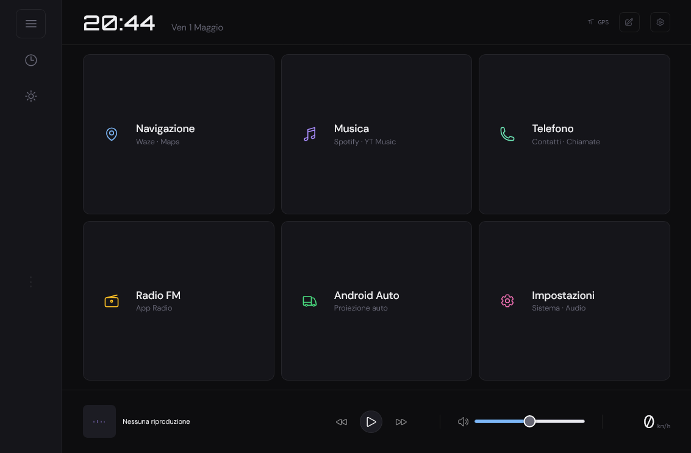
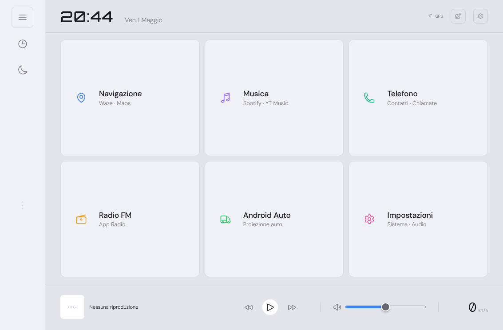

# StradaLauncher

Launcher Android per autoradio/headunit, pensato per schermi landscape 1280x720.
La UI e' una dashboard HTML/CSS/JS caricata dentro una WebView nativa Android, con bridge Java per app installate, GPS, media session, volume e luminosita'.

## Anteprima

Modalita' scura:



Modalita' chiara:



## Cosa fa

- Griglia principale 3x2 con scorciatoie grandi per navigazione, musica, telefono, radio, Android Auto e impostazioni.
- Drawer con tutte le app installate e ricerca rapida.
- Personalizzazione degli slot: app singola, gruppo di app, etichetta/sottotitolo e intent Android custom.
- Barra media con titolo corrente, copertina album, play/pausa, traccia precedente/successiva e volume.
- Velocita' GPS in km/h aggiornata dal servizio Android.
- Modalita' orologio fullscreen per usare lo schermo come clock da auto.
- Temi dark/light, palette multiple, font, stile icone, stile schede e scala testo/icone.
- Luminosita' via hardware Android oppure filtro software.
- Persistenza impostazioni con `SharedPreferences`.

## Stack

- Java/Kotlin Android project tradizionale, senza framework frontend.
- `WebView` fullscreen come shell nativa.
- UI single-file in `app/src/main/assets/launcher.html`.
- `NotificationListenerService` per leggere lo stato media dalle media session Android.

## Struttura progetto

```text
app/src/main/
  assets/
    launcher.html              # UI completa: HTML, CSS e JavaScript
  java/com/stradalauncher/
    MainActivity.java          # WebView host, bridge JS, GPS, volume, media polling
    MediaListenerService.java  # NotificationListenerService per media session
  res/layout/
    activity_main.xml          # WebView fullscreen
```

## Setup

1. Apri la cartella del progetto in Android Studio.
2. Attendi il sync Gradle.
3. Collega la headunit o un device Android con Debug USB attivo.
4. Avvia l'app da Android Studio oppure compila da terminale:

```bash
./gradlew assembleDebug
```

APK debug:

```text
app/build/outputs/apk/debug/app-debug.apk
```

## Primo avvio

### Launcher predefinito

Premi Home sul dispositivo Android, scegli **Strada Launcher** e conferma **Sempre**.

### Accesso notifiche

Serve per leggere titolo, artista, stato play/pausa e copertina dai player musicali:

```text
Impostazioni Android -> App -> Accesso speciale -> Accesso alle notifiche -> Strada Launcher
```

### Posizione

Concedi il permesso posizione per mostrare la velocita' GPS e per la modalita' tema Alba/Tramonto.

## Personalizzazione

Tocca **Edit** nella barra in basso per entrare in modalita' modifica.
Da li puoi assegnare app agli slot, cambiare testo, svuotare un pulsante o configurare intent Android custom.

Le impostazioni dell'interfaccia sono nel pannello con icona ingranaggio:

- tema manuale, sistema o alba/tramonto;
- palette colore;
- font e stile icone;
- schede monocromo, tinte o vivaci;
- scala testo e icone;
- luminosita' hardware/software.

## Bridge JavaScript

Oggetto disponibile nella WebView: `Android`.

| Metodo | Descrizione |
| --- | --- |
| `Android.getInstalledApps()` | Ritorna JSON con app installate, package name e icona base64. |
| `Android.launchApp(pkg)` | Apre un'app dal package name. |
| `Android.launchIntent(json)` | Lancia un intent Android custom configurato dalla UI. |
| `Android.openSettings(type)` | Apre impostazioni Android generiche, display, audio, Wi-Fi o Bluetooth. |
| `Android.saveButtonConfig(json)` / `Android.loadButtonConfig()` | Salva/carica configurazione slot. |
| `Android.saveSettings(json)` / `Android.loadSettings()` | Salva/carica preferenze UI. |
| `Android.mediaAction(action)` | Invia play/pausa, avanti, indietro alle media session. |
| `Android.getVolumeInfo()` / `Android.setVolume(level)` | Legge e imposta volume musica. |
| `Android.setScreenBrightness(value)` | Regola luminosita' finestra Android. |

Callback chiamate da Java verso JS:

| Callback | Descrizione |
| --- | --- |
| `window.onGpsSpeed(kmh)` | Aggiorna velocita' GPS. |
| `window.onMediaUpdate(track)` | Aggiorna testo traccia. |
| `window.onPlaybackState(playing)` | Aggiorna stato play/pausa. |
| `window.onAlbumArt(dataUrl)` | Aggiorna copertina album. |

## Sviluppo UI

La UI sta quasi tutta qui:

```text
app/src/main/assets/launcher.html
```

Dopo modifiche agli asset serve ricompilare e reinstallare l'APK: non basta pushare il file sulla headunit.

## Requisiti

- Android Studio recente.
- Android SDK 26+.
- JDK compatibile con Gradle Android plugin del progetto.
- Headunit o device Android landscape consigliato 1280x720.
